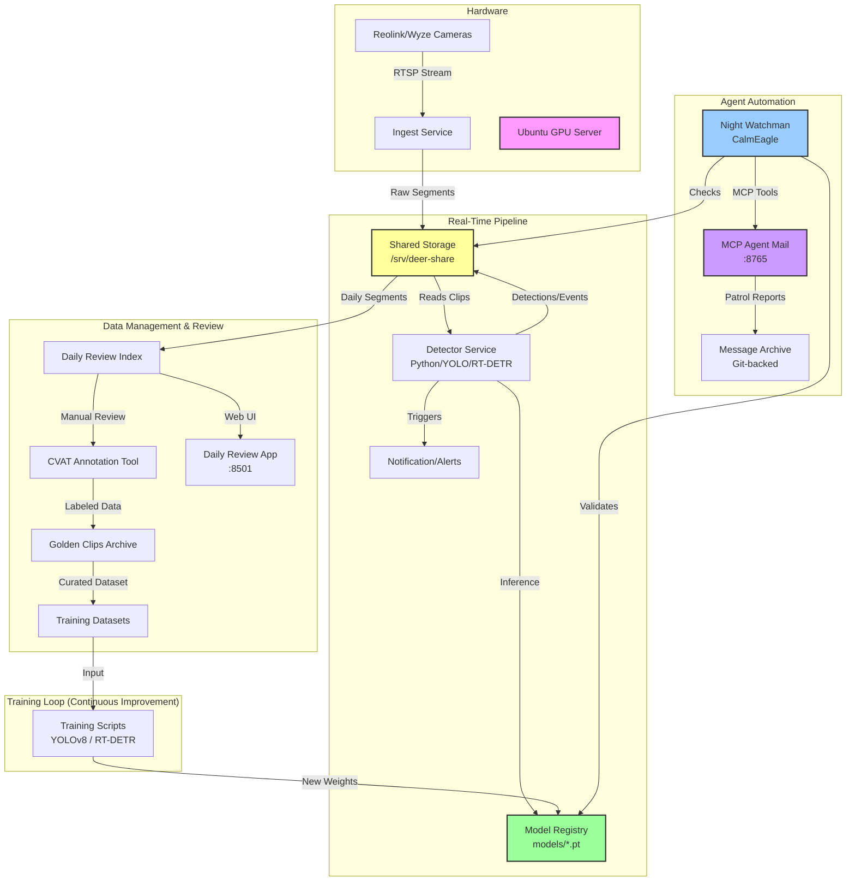

# DeerAITrackingResponse System Architecture

This document outlines the architecture of the DeerAI wildlife detection and deterrence system, based on repository analysis and live system checks.

## System Overview

The system is designed to detect deer and other wildlife on a property using a network of cameras, process the video feeds in real-time, tracker animal movements, and enable deterrent actions. It features a continuous learning loop where new footage is labeled and used to retrain models.

### High-Level Architecture



## Core Components

### 1. Ingest & Storage
*   **Ingest**: Python scripts (`capture_rtsp_clip.py`, pipeline bash scripts) capture video chunks from network cameras via RTSP.
*   **Storage**: A Samba share (`/srv/deer-share`) acts as the central data bus, storing raw clips, processed events, and model weights. This allows the Ubuntu server to handle heavy processing while Mac clients can mount the share for review/analysis.

### 2. Detection Engine
*   **Multi-Model Approach**: The system utilizes a tiered detection strategy:
    *   **YOLOv8** (Nano): Fast, high-recall detection.
    *   **RT-DETR**: Higher accuracy transformer-based model for confirmation and reducing false positives (e.g., distinguishing deer from dogs/people).
*   **Execution**: Runs on the Ubuntu server (RTX 3080).
*   **Logic**: `scripts/live_detector_multimodel.py` coordinates the models, processing clips as they arrive in shared storage.

### 3. Feedback Loop (The "Golden" Path)
*   **Daily Review**: The system generates a `daily_review_index.json` which flags interesting or low-confidence clips.
*   **Golden Clips**: High-value clips (e.g., perfect buck shots, tricky false positives, rare animals) are promoted to a "Golden Clips" archive.
*   **Retraining**:
    *   `train_yolov8n_golden.py` and `train_rtdetr_golden.py` scripts consume these curated datasets.
    *   New models are versioned (e.g., `v4`, `v5.1`, `v7`) and hot-swapped into the detection engine.

### 4. Health & Monitoring
*   **Health Check**: `scripts/pipeline_health_check.py` validates the pipeline by running standard test clips (`deer_test.mkv`, `person_test.mkv`) against loaded models to ensure no regressions (e.g., ensuring "person" isn't misclassified as "deer").
*   **Dashboard**: A tmux-based dashboard allows monitoring of GPU usage, disk space, and log tails.

### 5. Agent Coordination (MCP Agent Mail)

The system uses **MCP Agent Mail** for multi-agent coordination - a mail-like layer that lets coding agents communicate asynchronously.

*   **Server**: HTTP-based MCP server running on `192.168.68.71:8765`
*   **Storage**: SQLite database + Git-backed message archive
*   **Capabilities**:
    *   Agent identity registration (adjective-noun names like "CalmEagle")
    *   Threaded messaging with importance levels
    *   File reservations to prevent edit conflicts
    *   Inbox/outbox with acknowledgment tracking

**Architecture**:
```
┌─────────────────┐     MCP Tools      ┌──────────────────┐
│  Claude Code    │◄──────────────────►│  MCP Agent Mail  │
│  (Night Watch)  │   register_agent   │  Server :8765    │
│                 │   send_message     │                  │
│                 │   fetch_inbox      │  ┌────────────┐  │
│                 │   acknowledge      │  │  SQLite    │  │
└─────────────────┘                    │  │  + Git     │  │
                                       │  └────────────┘  │
                                       └──────────────────┘
```

### 6. Night Watchman Agent

An autonomous patrol agent that runs daily at 1am Central Time to monitor system health and wildlife activity.

*   **Location**: `agents/night-watchman/`
*   **Identity**: CalmEagle (registered in Agent Mail)
*   **Schedule**: Cron job at `0 7 * * *` (7am UTC = 1am CT)

**Patrol Steps** (defined in `SKILL_v2.md`):
1. **Disk Health**: Check free space on `/` and `/home`
2. **Pipeline Health**: Run `pipeline_health_check.py --lighting night`
3. **Detection Summary**: Count events in `/srv/deer-share/runs/live/events/`
4. **Write Digest**: Create markdown report in `runs/logs/watchman/YYYY-MM-DD.md`
5. **Agent Mail**: Register, send patrol report to NIGHT-WATCHMAN thread, check inbox

**Launcher** (`run.py`):
*   Discovers Claude CLI binary
*   Spawns Claude Code with MCP Agent Mail tools
*   Default timeout: 5 minutes

**Files**:
| File | Purpose |
|------|---------|
| `run.py` | Minimal launcher (~220 lines) |
| `run.sh` | Cron wrapper with shell timeout |
| `SKILL_v2.md` | Patrol instructions for Claude Code |

### 7. Daily Review App

A Streamlit-based web UI for reviewing detection events.

*   **URL**: `http://192.168.68.71:8501/`
*   **Script**: `scripts/daily_review_app.py`
*   **Data Source**: `/srv/deer-share/runs/live/events/` and `/srv/deer-share/runs/live/analysis/`

**Features**:
*   Thumbnail gallery with detection bounding boxes
*   Confidence filtering and routing decision display
*   Video playback with metadata inspection
*   Tag management for feedback loop

## Current Health Status (Jan 4, 2026)

**Pipeline Health Check**: **HEALTHY** (Verified with v7 models)
*   **Command**: `scripts/pipeline_health_check.py --lighting night` (auto-selects night models)
*   **Result**:
    *   **Day Mode**: `deer_test.mkv` (PASS), `person_test.mkv` (PASS)
    *   **Night Mode**: `deer_test_night.mkv` (PASS) - 33 deer detections, 94.3% max confidence
*   **Models verified**:
    *   `yolov8n_wildlife_v7_day.pt` / `rtdetr_wildlife_v7_day.pt`
    *   `yolov8n_wildlife_v7_night.pt`

**Night Watchman Status**: **OPERATIONAL**
*   **Agent**: CalmEagle
*   **Last Patrol**: 2026-01-04 21:18 CT
*   **System Health**: OK (69% disk free)
*   **Detection Events**: 7 events detected (2026-01-03), high confidence 0.83-0.94

**Analysis**: The system is fully operational. The v7 models correctly distinguish between deer and persons in day clips and successfully detect deer in night IR footage. The Night Watchman agent runs automated patrols and reports via MCP Agent Mail.
