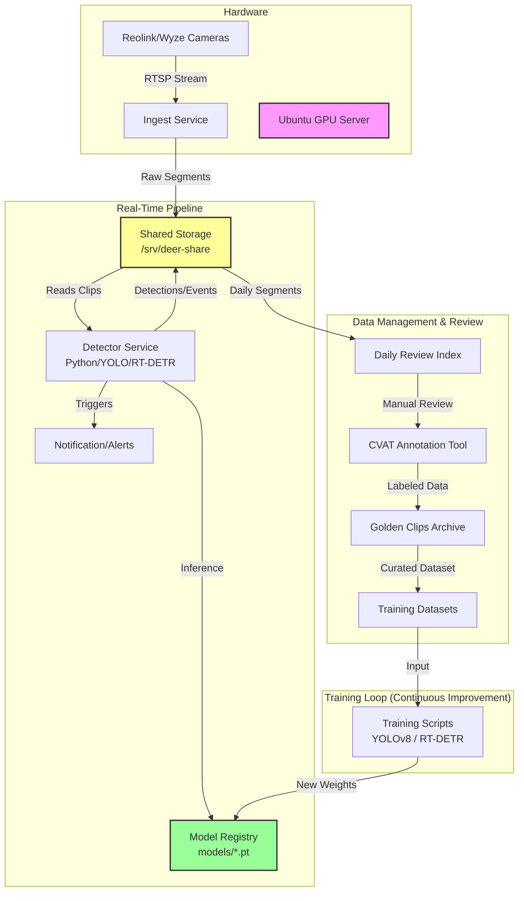

# DeerAITrackingResponse System Architecture

This document outlines the architecture of the DeerAI wildlife detection and deterrence system, based on repository analysis and live system checks.

## System Overview

The system is designed to detect deer and other wildlife on a property using a network of cameras, process the video feeds in real-time, tracker animal movements, and enable deterrent actions. It features a continuous learning loop where new footage is labeled and used to retrain models.

### High-Level Architecture

## Core Components

### 1. Ingest & Storage
*   **Ingest**: Python scripts (`capture_rtsp_clip.py`, pipeline bash scripts) capture video chunks from network cameras via RTSP.
*   **Storage**: A Samba share (`/srv/deer-share`) acts as the central data bus, storing raw clips, processed events, and model weights. This allows the Ubuntu server to handle heavy processing while Mac clients can mount the share for review/analysis.

### 2. Detection Engine
*   **Multi-Model Approach**: The system utilizes a tiered detection strategy:
    *   **YOLOv8** (Nano): Fast, high-recall detection.
    *   **RT-DETR**: Higher accuracy transformer-based model for confirmation and reducing false positives (e.g., distinguishing deer from dogs/people).
*   **Execution**: Runs on the Ubuntu server (RTX 3080).
*   **Logic**: `scripts/live_detector_multimodel.py` coordinates the models, processing clips as they arrive in shared storage.

### 3. Feedback Loop (The "Golden" Path)
*   **Daily Review**: The system generates a `daily_review_index.json` which flags interesting or low-confidence clips.
*   **Golden Clips**: High-value clips (e.g., perfect buck shots, tricky false positives, rare animals) are promoted to a "Golden Clips" archive.
*   **Retraining**:
    *   `train_yolov8n_golden.py` and `train_rtdetr_golden.py` scripts consume these curated datasets.
    *   New models are versioned (e.g., `v4`, `v5.1`, `v7`) and hot-swapped into the detection engine.

### 4. Health & Monitoring
*   **Health Check**: `scripts/pipeline_health_check.py` validates the pipeline by running standard test clips (`deer_test.mkv`, `person_test.mkv`) against loaded models to ensure no regressions (e.g., ensuring "person" isn't misclassified as "deer").
*   **Dashboard**: A tmux-based dashboard allows monitoring of GPU usage, disk space, and log tails.

## Current Health Status (Dec 31, 2025)

**Pipeline Health Check**: **HEALTHY** (Verified with v7 models)
*   **Command**: `scripts/pipeline_health_check.py` (Defaults to v7 day models)
*   **Result**:
    *   **Day Mode**: `deer_test.mkv` (PASS), `person_test.mkv` (PASS)
    *   **Night Mode**: `deer_test_night.mkv` (PASS)
*   **Models verified**:
    *   `yolov8n_wildlife_v7_day.pt` / `rtdetr_wildlife_v7_day.pt`
    *   `yolov8n_wildlife_v7_night.pt` / `rtdetr_wildlife_v7_night.pt`

**Analysis**: The system is fully operational. The v7 models correctly distinguish between deer and persons in day clips and successfully detect deer in night IR footage, resolving previous misclassification issues.
